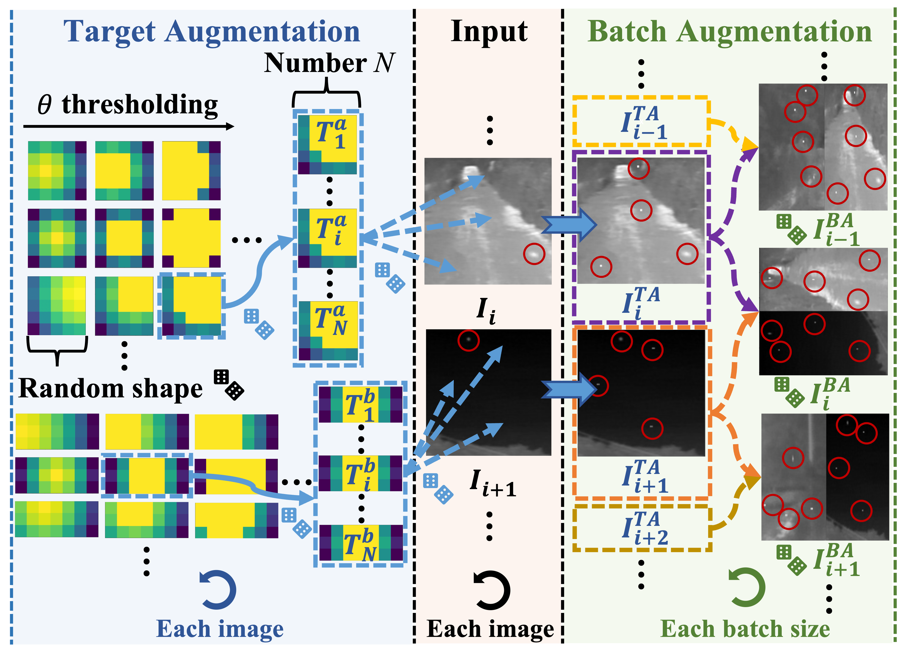

# AugTarget Data Augmentation




## Datasets

- MDFA dataset is available at [MDvsFa cGan](https://github.com/wanghuanphd/MDvsFA_cGAN).
- The SIRST Augment dataset: download from [Google Drive](https://drive.google.com/file/d/13hhEwYHU19oxanXYf-wUpZ7JtiwY8LuT/view?usp=sharing) or [BaiduYun Drive](https://pan.baidu.com/s/1c35pADjPhkAcLwmU-u0RBA) with code `ojd4`.

## Usage

### Train
```python
python train.py --net-name agpcnet_1 --batch-size 8 --save-iter-step 20 --dataset mdfa --learning-rate 0.05
```

```python
python train.py --net-name agpcnet_1 --batch-size 8 --save-iter-step 40 --dataset sirstaug --learning-rate 0.1
```

```python
python train.py --net-name agpcnet_1 --batch-size 8 --save-iter-step 100 --dataset merged --learning-rate 0.05
```

### Inference

```python
python inference.py --pkl-path {checkpoint path} --image-path {image path}
```

### Evaluation
```python
python evaluation.py --dataset {dataset name} 
                     --sirstaug-dir {base dir of sirstaug}
                     --mdfa-dir {base dir of MDFA}
                     --pkl-path {checkpoint path}
```


## Results

| Methods | Data      | Precision | Recall | mIoU   | Fmeasure | AUC    | Download | 
| :---:   | :---:     | :---:     | :---:  | :---:  | :---:    | :---:  | :---:    |
| AGPCNet | MDFA      | 0.5939    | 0.7241 | 0.4843 | 0.6525   | 0.8682 | [model](./baseline/mdfa_mIoU-0.4843_fmeasure-0.6525.pkl) |
| AGPCNet | SIRST Aug | 0.8323    | 0.8542 | 0.7288 | 0.8431   | 0.9344 | [model](./baseline/sirstaug_mIoU-0.7288_fmeasure-0.8431.pkl) |
| AGPCNet | Merged    | 0.7453    | 0.8384 | 0.6517 | 0.7891   | 0.9194 | [model](./baseline/merged_mIoU-0.6517_fmeasure-0.7891.pkl) |
| AGPCNet+AugTarget | MDFA      | 0.6482    | 0.7141 | 0.5146 | 0.6795   | 0.8699 | [model](./result/mdfa/mdfa_AugTarget.pkl) |
| AGPCNet+AugTarget  | SIRST Aug | 0.8449    | 0.8704 | 0.7505 | 0.8574   | 0.9378 | [model](./result/sirstaug/sirstaug_AugTarget.pkl) |
| AGPCNet+AugTarget  | Merged    | 0.7576    | 0.8658 | 0.6780 | 0.8081   | 0.9395 | [model](./result/merged/merged_AugTarget.pkl) |

## Acknowledgement
Our Target Augmentation algorithm is based on the random strategy of [Random-Erasing](https://github.com/zhunzhong07/Random-Erasing), thanks for their contributions.
This repository is based on baseline model from [AGPCNet](https://github.com/Tianfang-Zhang/AGPCNet) and modified part of the code.


## Contact
If any questions, kindly contact with Shengjia Chen via e-mail: csj_uestc@126.com.


## Referrences
1. Zhong, Zhun, et al. "Random erasing data augmentation." Proceedings of the AAAI conference on artificial intelligence. Vol. 34. No. 07. 2020. [[code]](https://github.com/zhunzhong07/Random-Erasing) 

2. Zhang, Tianfang, et al. "AGPCNet: Attention-Guided Pyramid Context Networks for Infrared Small Target Detection." arXiv preprint arXiv:2111.03580 (2021). [[code]](https://github.com/Tianfang-Zhang/AGPCNet)


## Citation

If you find this repo useful, please cite our paper. 

```
@inproceedings{chen2023augtarget,
  title={AugTarget Data Augmentation for Infrared Small Target Detection},
  author={Chen, Shengjia and Zhu, Jiewen and Ji, Luping and Pan, Hongjun and Xu, Yuhao},
  booktitle={IEEE International Conference on Acoustics, Speech and Signal Processing (ICASSP)},
  pages={1--5},
  year={2023},
  organization={IEEE}
}
```


